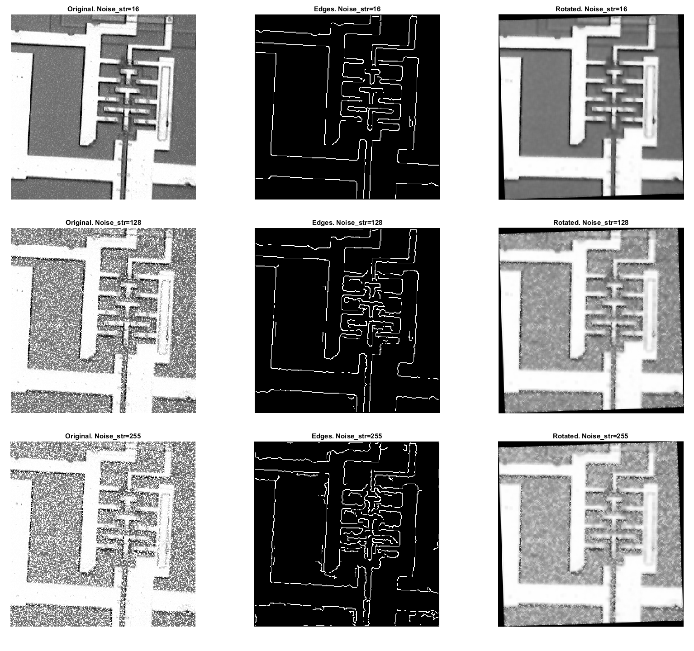
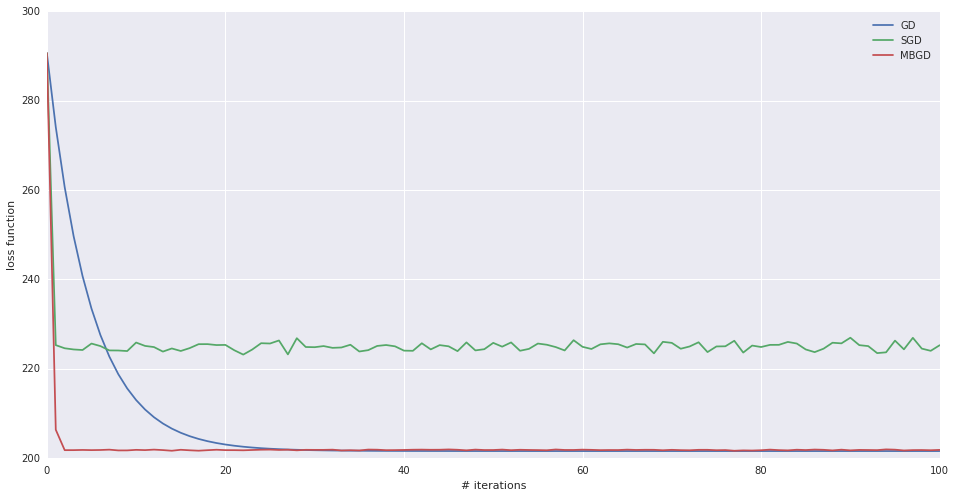
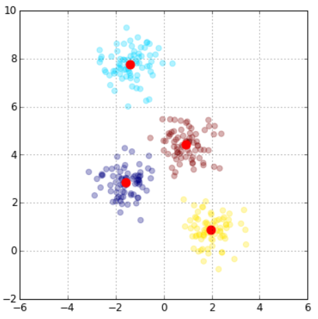
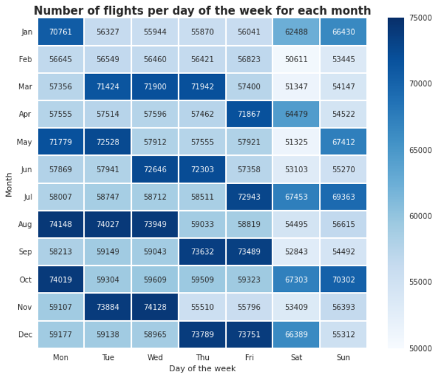
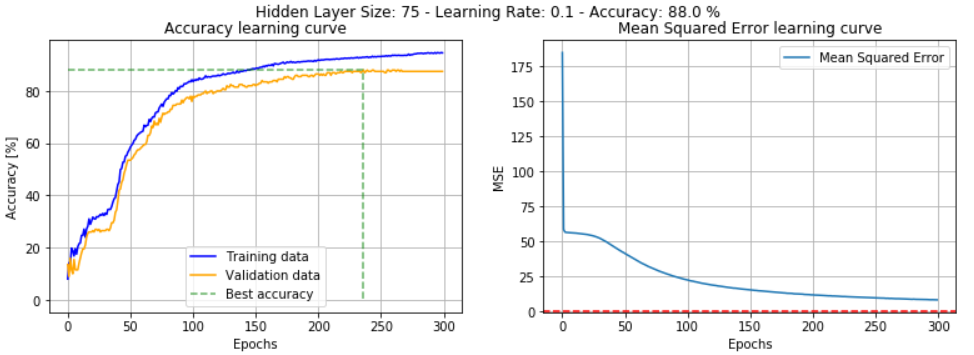

# EURECOM ML Projects
 A collection of projects regarding distributed machine learning, computer vision, bayesian modeling and deep learning

## [Satellite images adjustment](https://github.com/giacomodeodato/EURECOM-ML-Projects/blob/main/Satellite%20image%20adjustment/Report/improc_lab3_deodato_patti.pdf)

 * <b>Denoising</b>.
   After loading the image in Matlab, I added some noise and compared the results after the application of three different filters:
    * Averaging filter
    * Median filter
    * Wiener filter
 * <b>Low level feature detection</b>.
   In order to highlight the edges, I compared the performance of three approaches:
    * Gradient filter
    * Laplacian filter's zero crossings
    * Canny edge detector
 * <b>High level detection and interpretation</b>.
   I displayed and analyzed the Radon and Hough transforms. After interpreting the Radon transform points, I extracted the image orientation and rotated it.
   
## [Music recommender system](https://github.com/giacomodeodato/EURECOM-ML-Projects/blob/main/Music%20recommender%20system/Recommender%20System.ipynb)
After analyzing and cleaning a dataset publihsed by Audioscrobbler, I implemented a music recommender system in Python using collaborative filtering. I optimized the corresponding matrix factorization problem using the Alternating Least Squares algorithm both on a single machine and in a distributed fashion, exploiting Spark MLLib. I evaluated the performance by ranking the recommendations on artist held-out data.
Finally, I developed a hybrid music recommender system that uses an internal hyper-parameter to balance between a collaborative filtering approach and a content-based one. This idea allows to make recommendations by exploiting the similarities both between users and between items (i.e. artists).
  
## [Batch, mini-batch, stochastic and distributed gradient descent](https://github.com/giacomodeodato/EURECOM-ML-Projects/blob/main/Gradient%20descent/Gradient%20Descent.ipynb)

I manually implemented batch, mini-batch and stochastic gradient descent using Python and numpy and compared their performance on a regression problem. I analyzed the relation between the different algorithm versions by changing the values of their paramenters (learning rate, the number of iterations, batch size). Finally, I implemented the distributed version of mini-batch gradient descent using PySpark and analyzed the performance of all the algorithms in terms of dataset size and execution time.

## [K-means, k-means++ and distributed k-means](https://github.com/giacomodeodato/EURECOM-ML-Projects/blob/main/K%20Means/KMeans.ipynb)

I studied and implemented the k-means algorithm using Python and numpy. I analyzed the convergence of the algorithm on different 2D datasets of different shapes to easily visualize the results. I implemented smart centroid initialization in k-means++ to improve the clustering of unconventional shapes and I used the elbow method to find the optimal number of clusters. Finally, I implemented the distributed version of k-means with PySpark and compared it with the serial implementation.

## [Flight data analysis with SparkSQL](https://github.com/giacomodeodato/EURECOM-ML-Projects/blob/main/Distributed%20flight%20data%20analysis/Distributed%20flight%20data%20analysis.ipynb)

The last notebook introduces the DataFrame API and its advantages with respèct to RDDs, then, DataFrames are built starting from a structured file and from an RDD.

This section is followed by the analysis of flights data using SparkSQL. Data exploration is divided in three main sections: basic queries, flight volume statistics and additional queries. Data visualization is performed using the seaborn module.

The notebook ends with a bonus question regarding the analysis of other datasets and their relation with the used one.

## [Image classification algorithms](https://github.com/giacomodeodato/EURECOM-ML-Projects/blob/main/Image%20classification/Image_Classification.ipynb)

## Digital image processing - [Image filtering (Matlab)](https://github.com/giacomodeodato/EURECOM-ML-Projects/blob/main/Digital%20image%20processing/Image%20processing%20with%20Matlab/Image%20filtering/Report/improc_lab2_deodato.pdf), [Stereo images (Matlab)](https://github.com/giacomodeodato/EURECOM-ML-Projects/blob/main/Digital%20image%20processing/Image%20processing%20with%20Matlab/Stereo%20image%20processing/Report/improc_lab5_deodato_patti.pdf), [Image filtering (OpenCV)](https://github.com/giacomodeodato/EURECOM-ML-Projects/blob/main/Digital%20image%20processing/Image%20processing%20with%20OpenCV/imgprocessing.cpp)
This laboratory aims at analyzing the relation and performance of different kinds of filter in different domains:
 * Linear filtering in the frequency domain and analysis of the cutting frequency
 * Linear filtering in the spatial domain using the averaging filter varying its size and the noise intensity
 * Non linear filtering with the median filter and its performance with respect to the linear one.
 
Introduction to OpenCV, histogram equalization of the image and analysis of the different filters and edge detectors previously seen.

Processing of stereo images, stereo matching function to create disparity map with Sum of Absolute intensity Differences. Analysis of the result with different kernel sizes and images with different baselines. Depth computation and segmentation using the histogram of the distribution of grey values.

Finally, production of an anaglyph for 3D vision using colour filter glasses given the source images.
## [Financial risk estimation](https://github.com/giacomodeodato/EURECOM-ML-Projects/blob/main/Financial%20risk%20estimation/Monte%20Carlo%20Simulation.ipynb)
 * Introduction to Monte Carlo Simulations
 * Illustrative Example
 * Common Distributions used in MCS
 * Estimating Financial Risk of a Portfolio of Stocks
   * Terminology and Context
   * Data Preprocessing
     * Market factors and stocks
     * Missing values
     * Time alignment
   * A linear relationship between factors and stocks
   * Featurization of the factors
   * Defining distributions
   * Generating samples and calculating Value at Risk (VaR)
   * Evaluating results with backtesting method
   * Improving the distributions and the features
 * Summary
   
## [House prices regression](https://github.com/giacomodeodato/EURECOM-ML-Projects/blob/main/House%20prices%20regression/House%20Prices%20Regression.ipynb)

## [Convolutional neural networks with tensorflow](https://github.com/giacomodeodato/EURECOM-ML-Projects/blob/main/Convolutional%20neural%20networks/CNN.ipynb)

## [Multi layer perceptron](https://github.com/giacomodeodato/EURECOM-ML-Projects/blob/main/Multi%20layer%20perceptron/MLP.ipynb)

In this notebook we started building a Multi Layer Percepron using the sigmoid transfer function and Mean Squared Error loss function.
Initially we wrote down the calculation to execute one forward and one backward step on some artificial values, in order to see how the weights were updated. Then, we used numpy to implement a vectorized version of the feedforward and backprpagation algorithm and we added the methods to the NeuralNetwork class.

In the second part of the notebook we loaded the MNIST dataset and we defined a trin method for the NeuralNetwork class. In order to be more flexible we defined a general mini-batch gradient descent training so that we could compare the different performances of stochastic, batch and mini-batch gradient descent by changing the batch size (1 for stochastic; len(dataset) for batch; len(minibatch) for mini-batch).
Furthermore we tested the accuracy of neural networks with different hidden layer size and we compared and explained the results.
compare performances using networks with hidden layer of different size axplain the results

Finally we switched the trasfer function of the output layer with the softmax function and we used the cross-entropy loss, we tested the new network and underlined the improvements.

## [Introduction to python packages, pySpark and the HDFS](https://github.com/giacomodeodato/EURECOM-ML-Projects/blob/main/Introduction/Introduction.ipynb)
The aim of this introductory lab is to get familiar with the Jupyter notebooks, python and its modules (Pandas, Matplotlib, Numpy). Finally this notebook contains a presentation of PySpark and how to interact with the HDFS, together with two examples of distributed code: word count and an analysis of night flights.
  
