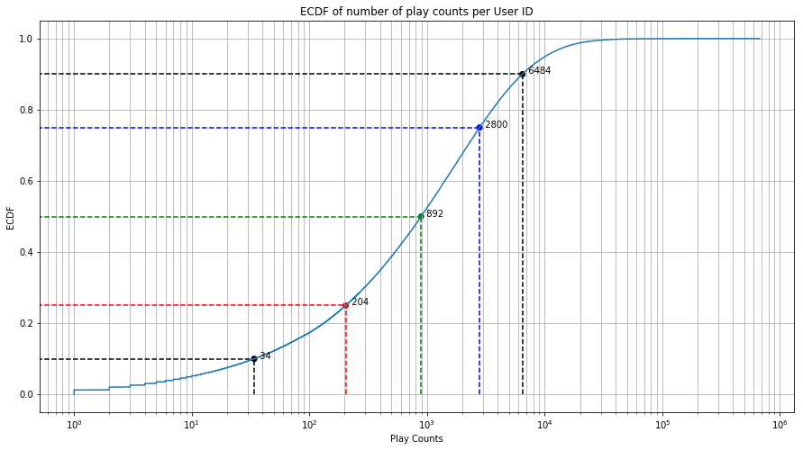
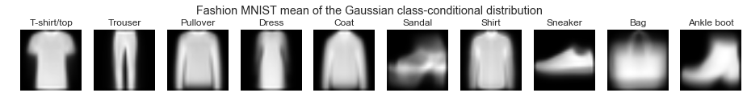
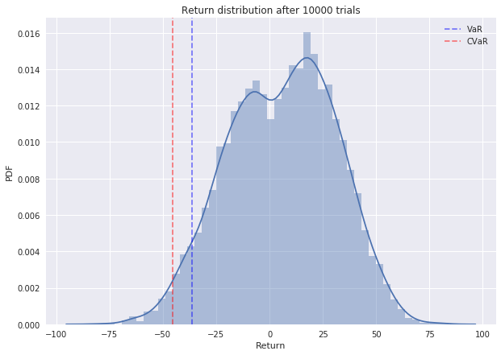
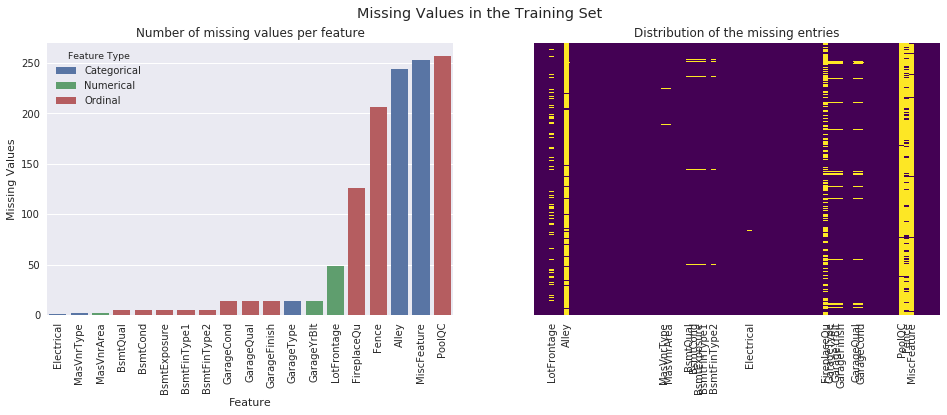

# EURECOM ML Projects
 A collection of projects regarding distributed machine learning, computer vision, bayesian modeling and deep learning

## [Satellite images adjustment](https://github.com/giacomodeodato/EURECOM-ML-Projects/blob/main/Satellite%20image%20adjustment/Report/improc_lab3_deodato_patti.pdf)

 * <b>Denoising</b>.
   After loading the image in Matlab, I added some noise and compared the results after the application of three different filters:
    * Averaging filter
    * Median filter
    * Wiener filter
 * <b>Low level feature detection</b>.
   In order to highlight the edges, I compared the performance of three approaches:
    * Gradient filter
    * Laplacian filter's zero crossings
    * Canny edge detector
 * <b>High level detection and interpretation</b>.
   I displayed and analyzed the Radon and Hough transforms. After interpreting the Radon transform points, I extracted the image orientation and rotated it.
   
## [Music recommender system](https://github.com/giacomodeodato/EURECOM-ML-Projects/blob/main/Music%20recommender%20system/Recommender%20System.ipynb)

After analyzing and cleaning a dataset publihsed by Audioscrobbler, I implemented a music recommender system in Python using collaborative filtering. I optimized the corresponding matrix factorization problem using the Alternating Least Squares algorithm both on a single machine and in a distributed fashion, exploiting Spark MLLib. I evaluated the performance by ranking the recommendations on artist held-out data.
Finally, I developed a hybrid music recommender system that uses an internal hyper-parameter to balance between a collaborative filtering approach and a content-based one. This idea allows to make recommendations by exploiting the similarities both between users and between items (i.e. artists).
  
## [Batch, mini-batch, stochastic and distributed gradient descent](https://github.com/giacomodeodato/EURECOM-ML-Projects/blob/main/Gradient%20descent/Gradient%20Descent.ipynb)

I manually implemented batch, mini-batch and stochastic gradient descent using Python and numpy and compared their performance on a regression problem. I analyzed the relation between the different algorithm versions by changing the values of their paramenters (learning rate, the number of iterations, batch size). Finally, I implemented the distributed version of mini-batch gradient descent using PySpark and analyzed the performance of all the algorithms in terms of dataset size and execution time.
 
 
 

## [K-means, k-means++ and distributed k-means](https://github.com/giacomodeodato/EURECOM-ML-Projects/blob/main/K%20Means/KMeans.ipynb)
I studied and implemented the k-means algorithm using Python and numpy. I analyzed the convergence of the algorithm on different 2D datasets of different shapes to easily visualize the results. I implemented smart centroid initialization in k-means++ to improve the clustering of unconventional shapes and I used the elbow method to find the optimal number of clusters. Finally, I implemented the distributed version of k-means with PySpark and compared it with the serial implementation.

 
 

## [Flight data analysis with SparkSQL](https://github.com/giacomodeodato/EURECOM-ML-Projects/blob/main/Distributed%20flight%20data%20analysis/Distributed%20flight%20data%20analysis.ipynb)
I analyzed a flight dataset using the DataFrame API that provides a better abstraction over distributed data with respect to RDDs (Resilient Distributed Dataset), the basic abstraction in Spark. I performed data exploration and analysis using pandas and SparkSQL, and I built insightful visualizations using seaborn and matplotlib. Finally, I integrated the original dataset with airport, carrier, plane and weather data to answer additional exploratory questions.

## [Image classification algorithms](https://github.com/giacomodeodato/EURECOM-ML-Projects/blob/main/Image%20classification/Image_Classification.ipynb)

I performed classification over the Fashion MNIST and CIFAR10 datasets using different models. I implemented the naive Bayes classifier and Bayesian regression using Python and numpy following the scikit-learn declaration style. I analyzed the performance of these models in terms of error, accuracy and confusion matrices, and I highlighted the strenght and weaknesses of the two approaches (clearly, Bayesian regression does not fit the classification task). Furthermore, I implemented a convolutional neural network using pytorch, I trained it on the Fashion MNIST dataset and I analyzed the convolutional filters. Finally, I explored possible integrations of the naive bayes features in the convolutional neural network.

## Digital image processing - [Image filtering (Matlab)](https://github.com/giacomodeodato/EURECOM-ML-Projects/blob/main/Digital%20image%20processing/Image%20processing%20with%20Matlab/Image%20filtering/Report/improc_lab2_deodato.pdf), [Stereo images (Matlab)](https://github.com/giacomodeodato/EURECOM-ML-Projects/blob/main/Digital%20image%20processing/Image%20processing%20with%20Matlab/Stereo%20image%20processing/Report/improc_lab5_deodato_patti.pdf), [Image filtering (OpenCV)](https://github.com/giacomodeodato/EURECOM-ML-Projects/blob/main/Digital%20image%20processing/Image%20processing%20with%20OpenCV/imgprocessing.cpp)

I analyzed the relation and performance of different filters and domains using MatLab and OpenCV:
 * Linear filtering in the frequency domain and analysis of the cutting frequency
 * Linear filtering in the spatial domain using the averaging filter varying its size and the noise intensity
 * Non linear filtering with the median filter and its performance with respect to the linear one.

Using MatLab, I processed stereo images, I implemented a stereo matching function to create the disparity map with the Sum of Absolute intensity Differences (SAD). I analysed the result with different kernel sizes and used images with different baselines. I computed the depth of the image and performed segmentation using the histogram of the distribution of grey values. Finally, I produced an anaglyph for 3D vision using colour filter glasses given the source images.

## [Financial risk estimation](https://github.com/giacomodeodato/EURECOM-ML-Projects/blob/main/Financial%20risk%20estimation/Monte%20Carlo%20Simulation.ipynb)

I estimated the financial risk of a portfolio of stocks including GSPC, IXIC, the return of crude oil and the return of treasury bonds. In order to do so, I calculated the Value at Risk (VaR) of a two weeks interval with 95% confidence level and the associated VaR confidence interval. After data analysis and cleaning, I approximated the distributions of the market factors using Kernel Density Estimation and I used featurization to improve the performance of a simple linear regression model. Finally, I used Monte Carlo sampling and p-value testing to estimate the risk and I backtested on historical data to validate the results.
   
## [House prices regression](https://github.com/giacomodeodato/EURECOM-ML-Projects/blob/main/House%20prices%20regression/House%20Prices%20Regression.ipynb)

I worked with a house prices dataset made of 81 features for 1200 entries (train data). I started by performing univariate analysis of the sale price and the individual features (after splitting them in categorical, ordinal and numerical). I performed missing values cleaning and imputation, outliers removal, and I encoded ordinal and categorical features. To finalize the preprocessing I performed feature engineering, normalization and scaling, and I selected the most relevant features using mutual information and the associated p-value. 

I started predicting the sale price using a simple linear regression without regularization to get a baseline of the performance. Successively, I explored the effects of different regularizations: Lasso, Ridge and ElasticNet, using a grid search approach to find the best hyper-parameters. Moreover, I trained a more complex model, XGBoost, and fine tuned its parameters using both grid search and Bayesian optimization. Finally, I evaluated two model ensemblig approaches: averaging and stacking.

## [Convolutional neural networks with tensorflow](https://github.com/giacomodeodato/EURECOM-ML-Projects/blob/main/Convolutional%20neural%20networks/CNN.ipynb)

I initially loaded the MNIST dataset and trained a logistic regression model using tensorflow. Using tensorboard, I visualized the computational graph, getting an overview of the model, and monitored the accuracy and loss learning curves. Then, I implemented LeNet 5 architecture and compared the performance obtained using standard gradient descent and Adam. Finally, I added dropout layers to the original architecture to improve the robustness of the model and its performance on test data.

## [Multi layer perceptron](https://github.com/giacomodeodato/EURECOM-ML-Projects/blob/main/Multi%20layer%20perceptron/MLP.ipynb)

I manually implemented a Multi Layer Percepron using the sigmoid transfer function and the Mean Squared Error loss function. Initially, I wrote down the calculation to execute one forward and one backward step on some artificial values, in order to see how the weights were updated. Then, I used numpy to implement a vectorized version of the feedforward and backpropagation algorithms and I added the methods to the NeuralNetwork class.

In the second part of the notebook, I loaded the MNIST dataset and defined a train method for the NeuralNetwork class. In order to be more flexible, I defined a general mini-batch gradient descent training so that I could compare the different performances of stochastic, batch and mini-batch gradient descent by changing the batch size (1 for stochastic; len(dataset) for batch; len(minibatch) for mini-batch). Furthermore, I tested the accuracy of neural networks with different hidden layer size, and I compared and explained the results. Finally, I changed the trasfer function of the output layer with the softmax function and implemented the cross-entropy loss to improve the neural network performance.

## [Introduction to python packages, pySpark and the HDFS](https://github.com/giacomodeodato/EURECOM-ML-Projects/blob/main/Introduction/Introduction.ipynb)
The aim of this introductory lab is to get familiar with the Jupyter notebooks, python and its modules (Pandas, Matplotlib, Numpy). Finally, this notebook contains a presentation of PySpark and how to interact with the HDFS, together with two examples of distributed code: word count and an analysis of night flights.
  
